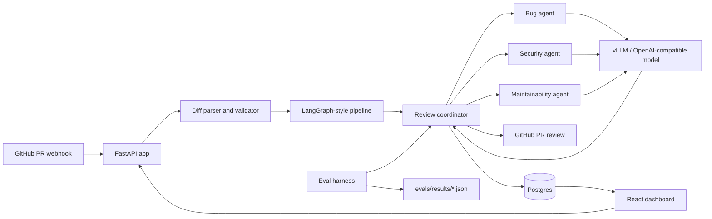
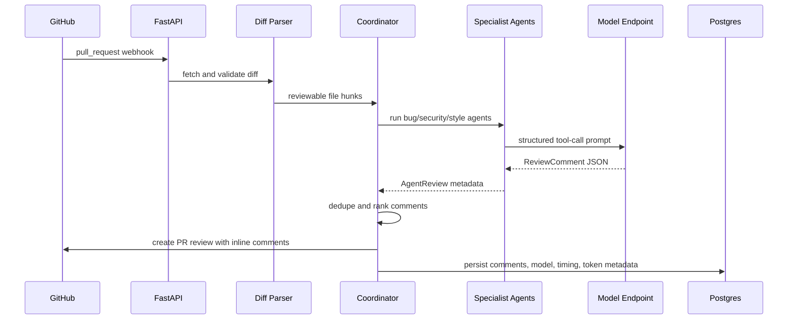

# CodeSentinel

CodeSentinel is an AI-powered pull request review system for experimenting with
production LLM engineering patterns around code review: structured outputs,
multi-agent coordination, QLoRA fine-tuning, vLLM-compatible serving, GitHub
webhooks, and model evaluation.

The core workflow is simple: a pull request diff enters the system, specialist
review agents inspect it for bugs, security vulnerabilities, and maintainability
issues, a coordinator deduplicates and ranks comments, and the final structured
review can be posted back to GitHub or explored in the dashboard.

This repository is intentionally measurement-oriented. It includes the
application pipeline, training/eval scaffolding, a small checked-in benchmark,
and tracked result artifacts so model behavior can be compared across runs.

## Highlights

- FastAPI backend with GitHub webhook, manual review trigger, review history,
  evaluation metrics, feedback capture, and health endpoints.
- Three-agent review pipeline: bug detector, security scanner, and
  maintainability reviewer.
- Shared Pydantic `ReviewComment` schema for model outputs, eval matching, DB
  persistence, and GitHub PR comments.
- Structured output via OpenAI-compatible tool/function calling.
- Coordinator with concurrent agent execution, deduplication, severity ranking,
  fine-tuned model routing, and GPT-4o fallback.
- GitHub review posting as a single PR review with inline comments.
- Dataset collection, cleaning, and ChatML formatting pipeline for PR review
  comments.
- QLoRA training config for Qwen2.5-Coder-7B, Modal training helper, LoRA merge
  script, and Hugging Face push helper.
- vLLM OpenAI-compatible serving launcher, AWQ quantization helper, and Modal
  serving scaffold.
- Eval harness with precision, recall, F1, severity accuracy, JSON parse rate,
  average latency, and optional GPT-4o-as-judge scoring.
- React dashboard with model comparison, recent reviews, review detail, timing
  breakdown, and feedback actions.
- Docker, Railway config, GitHub Actions CI, and automated tests.

## Architecture



## Review Flow



## Repository Map

| Path | Purpose |
|---|---|
| `app.py` | FastAPI entrypoint for webhooks, manual review, metrics, feedback, and static dashboard serving. |
| `agents/` | Structured review schema, base agent, specialist agents, and coordinator. |
| `pipeline/` | Diff parsing, review orchestration, runtime helpers, and GitHub posting. |
| `data/` | GitHub PR collection, cleaning, formatting, train/val split, and benchmark data. |
| `training/` | QLoRA training, Modal training, LoRA merge, inference smoke helper, and Hub upload. |
| `serving/` | vLLM launcher, Modal serving scaffold, client wrapper, and AWQ quantization. |
| `evals/` | Benchmark loader, metrics, GPT-4o judge, run scripts, and result artifacts. |
| `db/` | Postgres schema and async access functions. |
| `frontend/` | Vite/React dashboard and Zustand state store. |
| `tests/` | Unit tests for parsing, formatting, validation, coordinator, eval results, and pipeline nodes. |

## Tech Stack

| Layer | Technology |
|---|---|
| Backend | FastAPI, asyncio, Pydantic, httpx |
| Agent orchestration | LangGraph-style pipeline plus concurrent specialist agents |
| Model interface | OpenAI-compatible chat completions and function/tool calling |
| Fine-tuning | Hugging Face Transformers, PEFT, TRL, bitsandbytes, QLoRA |
| Base model target | Qwen2.5-Coder-7B-Instruct |
| Serving | vLLM, AWQ, Modal GPU scaffold |
| Database | Postgres, asyncpg |
| Evaluation | Custom Python metrics, optional GPT-4o judge, result JSON artifacts |
| Frontend | React, Vite, Zustand, lucide-react |
| Deployment | Docker, Railway app config, Modal GPU scaffolds |

## Quick Start

```bash
python3 -m venv .venv
source .venv/bin/activate
pip install -r requirements.txt
cp .env.example .env
python3 -m pytest -q
uvicorn app:app --reload --port 8765
```

In another terminal:

```bash
cd frontend
npm install
npm run dev
```

Open `http://localhost:5173`.

## Configuration

Copy [.env.example](.env.example) to `.env` and fill in values as needed.

| Variable | Purpose |
|---|---|
| `OPENAI_API_KEY` | GPT-4o fallback and optional judge/eval flows. |
| `GROQ_API_KEY` | Optional Groq baseline eval. |
| `VLLM_BASE_URL` | OpenAI-compatible vLLM endpoint. |
| `VLLM_MODEL_NAME` | Served fine-tuned model name. |
| `BASE_MODEL_NAME` | Base model used for eval comparison. |
| `FINETUNED_MODEL_NAME` | Fine-tuned model alias used by the app. |
| `GPT4O_MODEL_NAME` | GPT-4o fallback/eval model. |
| `GROQ_MODEL_NAME` | Groq model alias for baseline evals. |
| `GITHUB_TOKEN` | Required for posting PR reviews. |
| `GITHUB_WEBHOOK_SECRET` | HMAC secret for GitHub webhook verification. |
| `DATABASE_URL` | Postgres connection string. |
| `HF_TOKEN` | Hugging Face access token for gated model downloads/uploads. |
| `WANDB_API_KEY` | Optional Weights & Biases logging. |
| `RATE_LIMIT_PER_MINUTE` | Manual-review endpoint rate limit. |

## API

| Method | Path | Description |
|---|---|---|
| `GET` | `/health` | Health check. |
| `POST` | `/webhook/github` | GitHub pull request webhook receiver. |
| `POST` | `/api/review` | Manual review trigger. |
| `GET` | `/api/reviews` | Recent review history. |
| `GET` | `/api/reviews/{review_id}` | Review detail for the dashboard. |
| `GET` | `/api/eval/metrics` | Latest per-model eval metrics. |
| `POST` | `/api/feedback` | Store feedback for a review comment. |

## Structured Review Contract

All agents return comments that conform to this schema:

```json
{
  "category": "bug | security | style | maintainability",
  "severity": "critical | major | minor | nit",
  "file_path": "src/example.py",
  "line_start": 42,
  "line_end": 42,
  "message": "What is wrong and why it matters.",
  "suggestion": "A concrete fix, when available.",
  "confidence": 0.82
}
```

The schema is enforced through Pydantic validation and function/tool-calling
metadata passed to the model endpoint.

## Training Flow

```bash
pip install -r requirements-training.txt
python -m data.collect
python -m data.pipeline
python -m training.train
python -m training.merge
```

### Data Pipeline

`python -m data.collect` scrapes merged PR review comments and writes to
`data/raw/pr_samples.json`.

`python -m data.pipeline` chains:

1. **Clean**: filters bot comments, boilerplate, and low-signal comments.
2. **Format**: converts each comment into ChatML-style training messages.
3. **Split**: creates deterministic 90/10 train/val JSONL files.

The formatter preserves GitHub line metadata from `path`, `line`,
`original_line`, `start_line`, and `original_start_line` fields when available.

### Modal Training

```bash
pip install modal
modal setup
modal run training/modal_app.py
```

Required Modal secrets:

- `huggingface-secret` with `HF_TOKEN`.
- `wandb-secret` with `WANDB_API_KEY` if you want W&B logging.

The default config targets Qwen2.5-Coder-7B with rank-64 LoRA and NF4 4-bit
loading on CUDA. On non-CUDA local machines, `training.train` automatically
downshifts to a smaller local model unless overridden by:

```bash
export CODESENTINEL_LOCAL_TRAINING_MODEL=Qwen/Qwen2.5-Coder-1.5B-Instruct
export CODESENTINEL_LOCAL_OUTPUT_DIR=./checkpoints-v2
```

## Serving Flow

After training, merge LoRA adapters into the base model:

```python
from training.merge import merge_and_save

merge_and_save(
    "Qwen/Qwen2.5-Coder-7B-Instruct",
    "checkpoints",
    "models/codesentinel-merged",
)
```

Serve the merged model through vLLM:

```bash
pip install -r requirements-serving.txt
python -m serving.server models/codesentinel-merged
```

The FastAPI app calls the model through `VLLM_BASE_URL`. Modal serving scaffolding
is available in [serving/modal_app.py](serving/modal_app.py).

## Evaluation

The checked-in benchmark currently has 31 manually verified samples:

| Category | Samples |
|---|---:|
| Security | 9 |
| Bug | 8 |
| Style | 7 |
| Maintainability | 7 |

Run evals:

```bash
python -m evals.run_eval --model heuristic
python -m evals.run_eval --model base
python -m evals.run_eval --model finetuned
python -m evals.run_eval --model gpt4o
python -m evals.run_eval --model groq
```

Add GPT-4o-as-judge quality scoring:

```bash
python -m evals.run_eval --model finetuned --judge-quality
```

Result files are written to `evals/results/{model}.json` and
`evals/results/latest.json`.

### Current Results

| Model | Precision | Recall | F1 | Quality | Method |
|---|---:|---:|---:|---:|---|
| Heuristic rules | 20.0% | 3.3% | 5.7% | Not run | Rule-based fallback |
| Fine-tuned | 10.0% | 10.0% | 10.0% | Not run | QLoRA 7B |
| Llama-3.3 70B via Groq | 52.0% | 43.3% | 47.3% | Not run | Zero-shot hosted baseline |
| GPT-4o | 20.0% | 3.3% | 5.7% | Not run | API baseline |

The eval runner also records severity accuracy, JSON parse rate, and average
latency. See `evals/results/example.schema.json` for the result shape.

## Dashboard

The React dashboard shows:

- Model comparison metrics from `/api/eval/metrics`.
- Recent review history from `/api/reviews`.
- Manual PR review trigger.
- Review detail with comment list, severity/category metadata, suggestions,
  timing breakdown, and feedback buttons.

When `frontend/dist` exists, FastAPI serves the built dashboard from `/`.

## Deployment

### Docker

The Dockerfile builds the frontend with Node and serves it from the Python
runtime image:

```bash
docker build -t codesentinel .
docker run --env-file .env -p 8765:8765 codesentinel
```

### Railway

`railway.toml` is configured for a Dockerfile-based deployment with `/health`
as the health check.

### Modal

Use Modal for GPU-heavy jobs:

- `training/modal_app.py` for QLoRA training and adapter merge.
- `serving/modal_app.py` for GPU serving scaffold.
- `evals/modal_eval.py` for model eval on the checkpoint volume.

## Evidence Status

| Item | Status |
|---|---|
| Manually checked benchmark | Done, 31 samples checked in. |
| Heuristic baseline eval | Done. |
| Fine-tuned model eval | Done on current small benchmark. |
| Groq hosted baseline | Done. |
| GPT-4o eval | Done. |
| Training dataset | Done, `3226` train and `359` val samples checked in. |
| Base Qwen eval | Still needs a running vLLM base-model endpoint. |
| W&B/Hugging Face links | Not checked in yet. |
| Live GitHub PR screenshot or GIF | Not checked in yet. |
| Large benchmark target | Still below the original 200-sample target. |

## Development Checks

```bash
python3 -m pytest -q
python3 -m ruff check .
cd frontend && npm run build
```

For syntax-only import checks without writing to macOS global bytecode caches:

```bash
PYTHONPYCACHEPREFIX=/private/tmp/codesentinel_pycache \
  python3 -m compileall -q agents app.py config.py data db evals pipeline serving tests training
```

## Roadmap

The remaining high-value work is:

1. Expand the benchmark toward 200 manually verified samples.
2. Run base Qwen2.5-Coder through vLLM and check in `evals/results/base.json`.
3. Add W&B run links, final train/eval loss, JSON parse rate, and HF model link.
4. Deploy Railway API/frontend and Modal vLLM endpoint.
5. Capture a live GitHub PR review screenshot or GIF.
6. Add GitHub API retry/backoff and a no-issues-found review comment path.
